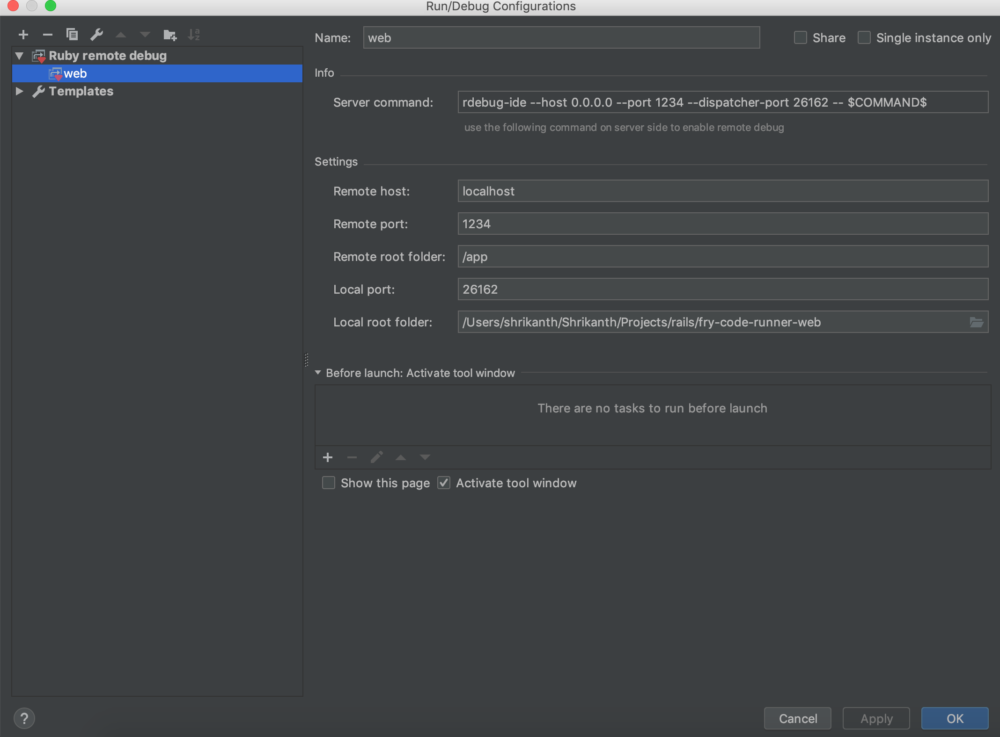

## Development Setup

1. docker-compose up
2. docker exec -it code-fry-app bash (log into container)

## Useful commands

docker-compose up -d (Bring up containers in daemon mode)

docker-compose stop (Stop containers)

docker-compose rm -f (stop and remove existing images)

docker-compose ps (Check Status of the containers)

docker exec -it postgres bash (To log into postgres container)

docker exec -it code-fry-app bash (To log into code-fry-app container)

docker-compose build (To build new images (run if you made any changes in your dockerfile))

## Rake commands to setup the app

1. docker exec -it code-fry-app bash (To log into code-fry-app container)
2. rake db:create
3. rake db:migrate
4. bundle exec rspec (to execute rspec tests)
5. rake rmq:publish (to publish messages to queue)

## Debug

> bundle exec rdebug-ide --host 0.0.0.0 --port 1234 --dispatcher-port 26162 -- /app/bin/rails s -b 0.0.0.0 -p 3000 -e development

> Expose   - "1234:1234" for web on docker compose.

> Add remote sdk for ruby (Rubymine -> Preferences -> SDK & Gems -> Language & Frameworks)

> Edit Config -> Add Remote ruby config -> 